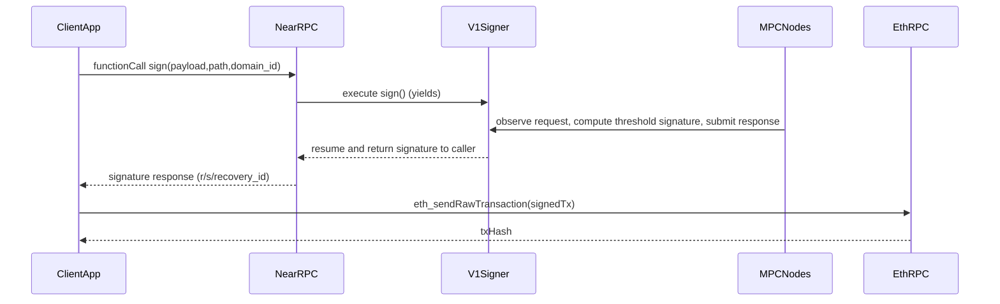

# Layer 3 Parity: Chain Signatures (vs Mainnet/Testnet)

This document answers two questions:

- **Where are we vs mainnet/testnet feature parity for Chain Signatures (Layer 3)?**
- **On mainnet, who broadcasts the signed transaction to Ethereum (or other chains)?**

This is intentionally **code-and-deployment inspection only** (no new features, no heavy tests).

---

## Sources (authoritative)

- NEAR docs: [Chain Signatures](https://docs.near.org/concepts/abstraction/chain-signatures)
- Upstream MPC implementation: [near/mpc](https://github.com/near/mpc) (also embedded as `cross-chain-simulator/mpc-repo`)
- Our current Layer 3 checkpoint (deployment + health evidence): `docs/CHECKPOINT_LAYER3_2025-01-01T01-15Z.md`

---

## Mainnet flow: who broadcasts?

### What Chain Signatures does (on mainnet/testnet)

From NEAR’s docs:

- The on-chain contract (`v1.signer` on mainnet) exposes a `sign` method with **payload + path + domain_id**.
- After the request, the contract **yields** while MPC signs, then **returns the signature to the user**.
- The returned signature is described as “a valid signed transaction that can be readily sent to the target blockchain to be executed.”

See: [NEAR docs: Chain Signatures](https://docs.near.org/concepts/abstraction/chain-signatures)

### Who broadcasts (the important clarity)

**The requester (client / dApp / relayer) broadcasts the signed transaction to the target chain.**

- The MPC network’s responsibility is to **produce** the signature (and submit any on-chain response back to `v1.signer` on NEAR).
- The NEAR contract’s responsibility is to **return** the signature to the caller.
- The final step “send to Ethereum” is done by an **off-chain broadcaster**, typically:
  - the end-user client (browser/backend), or
  - a dedicated relayer service operated by the app/team.

Also from NEAR’s docs: Chain Signatures is a **“one way”** solution for outbound transactions; for cross-chain state access, NEAR points to Omnibridge.  
See: [NEAR docs: Chain Signatures](https://docs.near.org/concepts/abstraction/chain-signatures)

### Visual flow (mainnet-parity conceptual model)

---

## Current localnet deployment status (what we actually have)

### ✅ Deployed and healthy (in-VPC)

From `docs/CHECKPOINT_LAYER3_2025-01-01T01-15Z.md`:

- **MPC nodes**: 3 nodes healthy (`/health` OK), reachable from NEAR base inside VPC
- **Contract**: `v1.signer.localnet` deployed (non-empty `code_hash`)

### ✅ Ethereum localnet exists

From CloudFormation stack `ethereum-localnet`:

- **eth_rpc_url**: `http://10.0.31.138:8545`
- **eth_chain_id**: `1337`

Verified from NEAR base EC2 via SSM:

- `eth_chainId` returned `0x539` (1337), meaning the Ethereum RPC is reachable from inside the VPC.

---

## Feature parity checklist (focused on Chain Signatures)

### P0: `domain_id=0` (Secp256k1 / EVM signing)

#### Infrastructure parity (prerequisites)

- **MPC nodes running and stable**: ✅ DONE (checkpoint evidence)
- **v1.signer contract deployed** (`v1.signer.localnet`): ✅ DONE (checkpoint evidence)
- **Ethereum localnet exists** (RPC endpoint + chainId): ✅ DONE (`ethereum-localnet` stack outputs)

#### Contract API parity (v1.signer semantics)

Expected per NEAR docs (mainnet semantics): `sign(payload, path, domain_id)` yields and returns signature to caller.

- **Sign request accepts `domain_id=0`**: ⚠️ UNKNOWN (contract supports it upstream; we did not explicitly verify domain registry state on-chain in this doc)
- **Deposit requirements enforced**: ✅ DONE at contract level (upstream contract is payable and checks minimum deposit)

#### SDK/client parity (our TS/JS surface)

These are the main gaps today:

- **Derived key derivation method parity**
  - **Expected**: use `derived_public_key(path, predecessor?, domain_id?)` for per-account derivation (contract API)
  - **Current**: our `NearClient.callPublicKey()` calls `public_key` with `{ path }` (mismatch)
  - **Status**: ❌ NOT DONE

- **Derivation path parity**
  - **Expected**: user-selected strings like `ethereum-1`, `ethereum-2` (docs)
  - **Current**: our default path builder uses `${nearAccount},${chainId}` (not docs-parity)
  - **Status**: ❌ NOT DONE

- **Sign call parameter parity**
  - **Expected**: structured request including `domain_id`, `payload`, `path`, with required deposit
  - **Current**: our client calls `sign` with `{ path, payload, recipient }` and attaches `0` deposit
  - **Status**: ❌ NOT DONE

- **Signature retrieval parity**
  - **Expected**: contract yields/resumes and returns signature in tx result (docs)
  - **Current**: our client polls `get_signature(signature_id)` which does not exist in the embedded contract version
  - **Status**: ❌ NOT DONE

- **EVM address derivation correctness**
  - **Expected**: Ethereum address derivation uses Keccak-256 of the uncompressed public key (EVM standard)
  - **Current**: simulator uses SHA-256 and truncation (placeholder)
  - **Status**: ❌ NOT DONE

- **Broadcast step availability**
  - **Expected**: after receiving signature, an off-chain component broadcasts via `eth_sendRawTransaction`
  - **Current**: we have an Ethereum RPC deployed, but no “broadcast helper” or wired flow in this repo
  - **Status**: ❌ NOT DONE (by design / not implemented yet)

### P2: `domain_id=1` (Ed25519)

- **Priority**: P2 (per user)
- **Contract support**: ✅ supported upstream
- **Our SDK support**: ❌ NOT DONE (we don’t pass domain_id or model Ed25519 flows yet)

---

## “Are we mainnet-parity for signing an Ethereum tx end-to-end?”

**Infrastructure parity is effectively DONE** (NEAR localnet + v1.signer.localnet + healthy MPC nodes + Ethereum localnet).

**Developer-facing signing parity is NOT DONE yet**, because our `cross-chain-simulator` JS client layer is not aligned with the current `near/mpc` contract API and EVM conventions (derived key call, sign request format, deposit, signature return path, Ethereum address derivation, broadcast step).

This means: **the system is ready**, but the “mainnet-like DX” path (derive → sign → broadcast) is not yet wired end-to-end in our library code.

