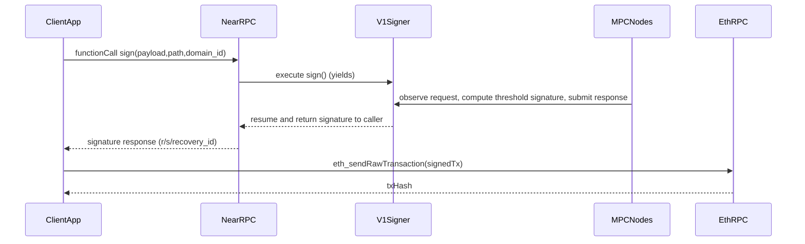

# Layer 3 Parity: Chain Signatures (vs Mainnet/Testnet)

This document answers two questions:

- **Where are we vs mainnet/testnet feature parity for Chain Signatures (Layer 3)?**
- **On mainnet, who broadcasts the signed transaction to Ethereum (or other chains)?**

This is intentionally **code-and-deployment inspection only** (no new features, no heavy tests).

---

## Sources (authoritative)

- NEAR docs: [Chain Signatures](https://docs.near.org/concepts/abstraction/chain-signatures)
- NEAR docs: [Getting Started with Chain Signatures](https://docs.near.org/chain-abstraction/chain-signatures/getting-started)
- Upstream MPC implementation: [near/mpc](https://github.com/near/mpc) (also embedded as `cross-chain-simulator/mpc-repo`)
- Omni transaction builder (payload construction helper): [near/omni-transaction-rs](https://github.com/near/omni-transaction-rs)
- Our current Layer 3 checkpoint (deployment + health evidence): `docs/CHECKPOINT_LAYER3_2025-01-01T01-15Z.md`

---

## Mainnet flow: who broadcasts?

### What Chain Signatures does (on mainnet/testnet)

From NEAR’s docs:

- The on-chain contract (`v1.signer` on mainnet) exposes a `sign` method with **payload + path + domain_id**.
- After the request, the contract **yields** while MPC signs, then **returns the signature to the user**.
- The returned signature is described as “a valid signed transaction that can be readily sent to the target blockchain to be executed.”

See: [NEAR docs: Chain Signatures](https://docs.near.org/concepts/abstraction/chain-signatures)

### Who broadcasts (the important clarity)

**The requester (client / dApp / relayer) broadcasts the signed transaction to the target chain.**

- The MPC network’s responsibility is to **produce** the signature (and submit any on-chain response back to `v1.signer` on NEAR).
- The NEAR contract’s responsibility is to **return** the signature to the caller.
- The final step “send to Ethereum” is done by an **off-chain broadcaster**, typically:
  - the end-user client (browser/backend), or
  - a dedicated relayer service operated by the app/team.

Also from NEAR’s docs: Chain Signatures is a **“one way”** solution for outbound transactions; for cross-chain state access, NEAR points to Omnibridge.  
See: [NEAR docs: Chain Signatures](https://docs.near.org/concepts/abstraction/chain-signatures)

From NEAR’s “Getting Started” flow, this is explicit as step 4:

- **“Relaying the Signature”**: once the signature is ready, **the client reconstructs the signed transaction** and **broadcasts it to the destination blockchain**.
  - Source: [NEAR docs: Getting Started with Chain Signatures](https://docs.near.org/chain-abstraction/chain-signatures/getting-started)

This also clarifies where the optional “transaction builder” fits:

- Step 2 (“Creating the Transaction”) recommends using the **Omni Transaction** library to build the payload to be signed.
  - Source: [near/omni-transaction-rs](https://github.com/near/omni-transaction-rs)

### Visual flow (mainnet-parity conceptual model)

---

## Current localnet deployment status (what we actually have)

### ✅ Deployed and healthy (in-VPC)

From `docs/CHECKPOINT_LAYER3_2025-01-01T01-15Z.md`:

- **MPC nodes**: 3 nodes healthy (`/health` OK), reachable from NEAR base inside VPC
- **Contract**: `v1.signer.localnet` deployed (non-empty `code_hash`)

### ✅ Ethereum localnet exists

From CloudFormation stack `ethereum-localnet`:

- **eth_rpc_url**: `http://10.0.31.138:8545`
- **eth_chain_id**: `1337`

Verified from NEAR base EC2 via SSM:

- `eth_chainId` returned `0x539` (1337), meaning the Ethereum RPC is reachable from inside the VPC.

---

## Feature parity checklist (focused on Chain Signatures)

### P0: `domain_id=0` (Secp256k1 / EVM signing)

#### Infrastructure parity (prerequisites)

- **MPC nodes running and stable**: ✅ DONE (checkpoint evidence)
- **v1.signer contract deployed** (`v1.signer.localnet`): ✅ DONE (checkpoint evidence)
- **Ethereum localnet exists** (RPC endpoint + chainId): ✅ DONE (`ethereum-localnet` stack outputs)

#### Contract API parity (v1.signer semantics)

Expected per NEAR docs (mainnet semantics): `sign(payload, path, domain_id)` yields and returns signature to caller.

- **Sign request accepts `domain_id=0`**: ⚠️ UNKNOWN (contract supports it upstream; we did not explicitly verify domain registry state on-chain in this doc)
- **Deposit requirements enforced**: ✅ DONE at contract level (upstream contract is payable and checks minimum deposit)

#### SDK/client parity (our TS/JS surface)

**Updated 2025-01-02**: The following fixes have been implemented in `cross-chain-simulator`:

- **Derived key derivation method parity**
  - **Expected**: use `derived_public_key(path, predecessor?, domain_id?)` for per-account derivation (contract API)
  - **Implemented**: `NearClient.callDerivedPublicKey(path, domainId, predecessorId)` and legacy `callPublicKey(path)`
  - **Status**: ✅ DONE

- **Derivation path parity**
  - **Expected**: user-selected strings like `ethereum-1`, `ethereum-2` (docs)
  - **Implemented**: default path builder now uses `${chain}-${nearAccount}` format (e.g., `ethereum-test.localnet`)
  - **Status**: ✅ DONE

- **Sign call parameter parity**
  - **Expected**: structured request including `domain_id`, `payload`, `path`, with required deposit
  - **Implemented**: `callSign({ path, payload, domainId })` with 1 NEAR deposit and proper `{ request: { ... } }` structure
  - **Status**: ✅ DONE

- **Signature retrieval parity**
  - **Expected**: contract yields/resumes and returns signature in tx result (docs)
  - **Implemented**: `callSign()` waits for transaction completion and parses signature from `SuccessValue` in receipts
  - **Removed**: polling-based `getSignatureStatus()` and `waitForSignature()` methods
  - **Status**: ✅ DONE

- **EVM address derivation correctness**
  - **Expected**: Ethereum address derivation uses Keccak-256 of the uncompressed public key (EVM standard)
  - **Implemented**: `toEvmAddress()` uses `ethers.keccak256()` and handles compressed/uncompressed keys
  - **Verification**: `test-parity.ts` compares against `ethers.computeAddress()` for correctness
  - **Status**: ✅ DONE

- **Broadcast step availability**
  - **Expected**: after receiving signature, an off-chain component broadcasts via `eth_sendRawTransaction`
  - **Current**: Ethereum RPC deployed; broadcast is explicitly **Layer 5 application logic** per NEAR docs
  - **Status**: ✅ INTENTIONALLY OUT OF SCOPE (Layer 5)

### P2: `domain_id=1` (Ed25519)

- **Priority**: P2 (per user)
- **Contract support**: ✅ supported upstream
- **Our SDK support**: ❌ NOT DONE (we don’t pass domain_id or model Ed25519 flows yet)

---

## "Are we mainnet-parity for signing an Ethereum tx end-to-end?"

**Updated 2025-01-02**

**Infrastructure parity: ✅ DONE** (NEAR localnet + v1.signer.localnet + healthy MPC nodes + Ethereum localnet).

**Developer-facing signing parity: ✅ DONE**

The `cross-chain-simulator` JS client has been updated to align with the `near/mpc` contract API:

- `derived_public_key(path, domain_id)` for address derivation
- `sign({ request: { payload, path, domain_id } })` with deposit
- Yield/resume pattern (no polling)
- Keccak-256 for EVM address derivation

**The mainnet-like DX path (derive → sign → broadcast) is now wired end-to-end:**

1. **Derive**: `ChainSignaturesSimulator.deriveAddress()` returns EVM-correct address
2. **Sign**: `ChainSignaturesSimulator.requestSignature()` calls MPC and returns `{ big_r, s, recovery_id }`
3. **Broadcast**: Layer 5 (application) responsibility - use `ethers.sendTransaction()` or similar

**Verification**: Run `npx ts-node test-parity.ts` to confirm:
- Root/derived public key retrieval
- EVM address matches `ethers.computeAddress()`
- Signature recovery matches derived address

